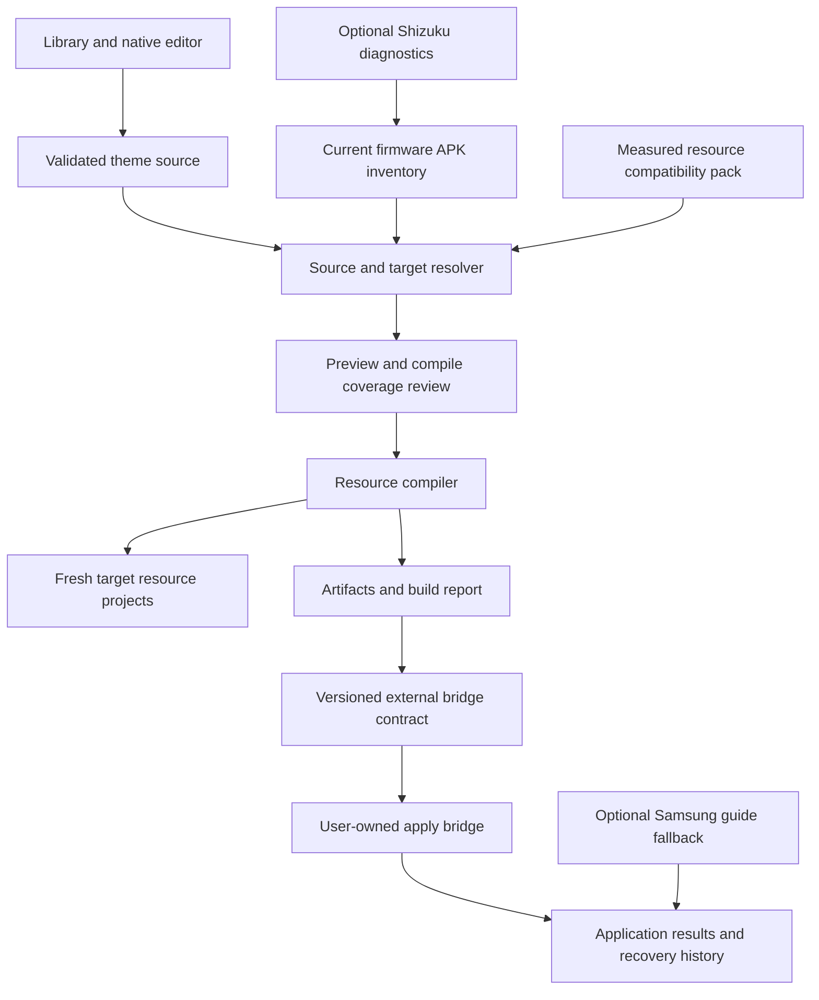

# One UI Studio: a One UI 9 theme application and source format

Status: design for review; no application implementation or device compatibility certification.

Repository baseline: `Bingblop/oneui-theme-engine`, commit `28515f9195ddadbaf9038970c123d26b191de092`.

## 1. Goal and first device

Create an independent successor to Hex Installer that preserves theme selection, color editing, component selection, previews, and reusable creator themes. The user clarified that the old Hex overlays were made for One UI 6.1.1 and fail now. The requested outcome includes a **fresh One UI 9 overlay collection**, authored from the current firmware's actual resources and permitted application route. Updating a theme editor alone does not fulfill that outcome. Old resource maps and compiled overlay APKs are excluded from the replacement collection.

The user requires **no root** and accepts Shizuku or ADB setup. The user subsequently clarified that they can develop the application bridge: this design must prioritize a theme and overlay source with the customization breadth of old Hex Installer, exposing a pluggable bridge contract rather than making bridge research the main deliverable. The working application name is **One UI Studio**. Its initial product scope is Samsung phones running One UI 9.0; older One UI releases and tablets are outside the first release.

The user's Software information screenshot supplies the first research target:

| Field | Observed value |
| --- | --- |
| Model identifier shown in software information | SM-S948U1 |
| One UI | 9.0 |
| Android | 17 |
| Build number | CP2A.260605.016.S948U1UEU4BZID |
| Baseband | S948U1UEU4BZID |
| Google Play system update | August 1, 2026 |
| SE for Android | Enforcing |

These observations identify a target, not a certified compatible device. A Google Play system update date is not the Android security patch date. The exact fingerprint, API level, security patch, Theme Park version, target APK identities, and overlay policy remain to be collected.

Success means a user can create and exchange a theme with Hex-style customization, generate newly authored components against the actual One UI 9 resource inventory, and pass those artifacts to the user's bridge. The fresh collection begins with framework, SystemUI, and Settings, then covers the Samsung applications enumerated in the overlay-suite design. **Build compatibility** (correct current targets/resources and successful compilation) and **application compatibility** (acceptance, effect, and recovery through a bridge) are separate reports. Source authoring and compilation can proceed before the bridge is complete. A compiled artifact must not be represented as applied or device-verified.

The fresh collection and evidence required to author it are specified in [oneui9-overlay-suite.md](../../design/oneui9-overlay-suite.md). A [read-only ADB collector](../../design/collect-oneui9-inputs.md) makes the missing device/resource inputs concrete. No current firmware APKs or on-device application results have been supplied.

## 2. What the current repository establishes

The repository already contains useful visual directions and three palettes. It does not establish a working nonroot One UI 9 application route.

| Current component | Evidence | Design decision |
| --- | --- | --- |
| `apps/hex-next` | WebView editor; `MainActivity.java` builds hardcoded fabrication commands and returns success without checking their exit codes. The HTML displays timed success before invoking the bridge. | Preserve the editor concepts; use a native application with operation-driven status. |
| `themes/*/theme.json` | Colors are tied directly to resource names, with no recorded device/resource inventory. | Reuse palette ideas; move firmware bindings out of creator themes. |
| `engine/fabricated.py` | Assumes `cmd overlay fabricate` is available and overlays are owned by `com.android.shell`. | Exclude shell fabrication from the no-root default. |
| `engine/shizuku_bridge.py` | Selects executable presence, with silent `su` and ordinary-shell fallbacks. | Replace with authenticated Shizuku lifecycle and capability-specific authorization; no root fallback. |
| `engine/cli.py` | Ignores apply results and prints success; no recovery journal. | Use structured outcomes, readback, and durable operation records. |
| `engine/overlay_builder.py` | Assumes package name is the overlayable group and does not validate target policy. | Keep only as a research reference until an eligible APK route is demonstrated. |
| Handwritten APK scripts | Unchecked build steps and signing key stored inside a cleaned output directory. | Use standard Gradle/Android SDK builds and persistent signing identity. |
| Theme Park stub and active-theme setting writes | No captured evidence that these create an accepted Samsung theme. | Exclude stub installation and theme-state spoofing from the new baseline. |

Existing documentation claims such as universal fabricated-overlay support, specific package migrations, and “100% compatibility” are hypotheses or unsupported assertions. This specification does not certify those claims. They should be corrected when the new application is implemented.

## 3. Platform constraints and approaches

Samsung's official One UI 9 beta announcement identifies Android 17 [1], consistent with the screenshot. Current AOSP shell-command code requires root for fabrication; OverlayManagerService also rejects fabrication from `SHELL_UID` [2, 3]. Shizuku under ADB runs with shell identity and cannot remove these checks.

RRO packages must satisfy the target's resource and overlayability policy. An installed APK, matching resource name, or exit code of zero does not prove that its resource was accepted or displayed [4]. Self-targeting overlays in the public OverlayManager API do not authorize replacement of Samsung's SystemUI [5]. These are Android constraints; Samsung-specific behavior must still be measured on the user's build.

| Approach | Benefit | Limitation | Decision |
| --- | --- | --- | --- |
| **Native app + fresh resource inventory + newly authored compatibility adapters** | Meets the requested source architecture and makes every new component traceable to the actual firmware. | The no-root application route must pass policy and device tests before working overlays can be delivered. | Recommended architecture; feasibility remains open. |
| Fabricate replacements through shell | Could avoid APK compilation if privileged fabrication were available. | Shell fabrication is blocked in current AOSP; Shizuku does not provide root. | Excluded from the no-root default. |
| Publish complete themes through Galaxy Themes Studio | Uses Samsung's distribution route. | Designer admission and Galaxy Store distribution requirements; not a general local theme compiler [7]. | Optional future distribution channel. |

Samsung's Good Lock team documented Theme Park's transition toward direct theme creation/application [6]. No published third-party Theme Park import/apply API was established in this investigation. **One UI Studio must not promise that Theme Park imports `.ouitheme` files.** The initial integration prepares a palette and assets, then provides version-tested instructions for Samsung's own UI. Neither accessibility automation nor private Samsung APIs are a baseline dependency.

Bridge development is a user-owned workstream. If automatic application is denied, report that result separately and retain the newly authored sources and build reports. A theme editor with Samsung companion steps is a fallback, not the requested replacement. Resource extraction and source compilation do not depend on resolving the application bridge, provided the necessary current APK inputs are available.

## 4. Application experience

The visual direction is a quiet dark interface with violet and mint accents, rounded grouped cards, large headings, and primary controls within thumb reach. Offer light and dark application modes independently of the theme being edited. Do not imitate Samsung branding or use Hex's proprietary artwork.

Four primary areas:

1. **Library:** built-in AMOLED Black, Neon Violet, and Cyberpunk Gold sources; local imports; saved drafts; small curated catalog later. Display theme author, license, version, and this device's available coverage.
2. **Studio:** semantic color controls, fonts, style presets, icons, supported shape/spacing controls, dark/light variants, component selection, and per-app overrides. Provide conceptual previews of quick panel, Settings, and keyboard. Mark unavailable previews and state that actual rendering may differ. Unsupported controls can be previewed and exported but cannot enter an automated apply plan.
3. **Device:** detected firmware, Samsung tools, Shizuku liveness, and per-component capability results. Keep technical details here; ordinary editing uses names such as Background and Accent.
4. **History:** saved source versions, application attempts, unresolved manual steps, and restoration options appropriate to each backend.

Normal flow: **Choose theme → Customize → Review coverage → Prepare/apply available components → Confirm result.**

On the first device, the user sees the observed SM-S948U1 build and “Theme compatibility not yet verified.” Preview and source export work regardless of privileged-service access. Connecting Shizuku updates diagnostics, not a blanket “supported” badge.

The apply review lists each selected component with one of: **Apply in app**, **Samsung setup steps**, **Not verified on this build**, or **Unavailable**. It explains omissions and waits for explicit acceptance of partial coverage. A required unavailable component prevents the plan.

For the guided Theme Park route, the app copies color values or shares supported assets, opens a detected Samsung launcher entry if available, and shows instructions matching the installed tool version. Unknown versions get generic preparation guidance, not invented menu names. Only user confirmation completes a manual step; record this as **User confirmed**, not device-verified application.

For an automated route, show progress from real operation events. Separate “command accepted,” “resource readback confirmed,” and “appearance confirmed.” Never infer whole-theme success from a successful bridge call or timer.

Recovery has the same clarity: **Restore automatically** only where prior state can be captured and restored; otherwise **Open Samsung theme settings** and identify the previous selection for the user. The app does not promise background rollback after a crash, reboot, or loss of authorization.

The screen concept is [oneui9-studio-concept.svg](../../design/oneui9-studio-concept.svg). Its capability labels illustrate the planned UI, not tested support.

## 5. New theme source: `.ouitheme`

The source is a ZIP container imported by One UI Studio. It contains declarative appearance data, licensed assets, and no APKs, executable plugins, shell commands, or firmware resource names.

```text
amoled-black.ouitheme
  manifest.json
  tokens/dark.json
  LICENSE.txt
  assets/                    # Optional wallpaper or icon assets
  previews/                  # Optional creator previews
```

`manifest.json` declares format, theme identity/version, author/license, intended UI family, token API, variants, optional per-app overrides, optional style-pack identity, assets, and requested components. One UI 9 targeting expresses intent; it is not a support claim. `tokens/dark.json` contains semantic color, dimension, and optional licensed-font values. `overrides/dark.json` can override these roles for abstract targets such as Settings, Keyboard, and Phone, without copying Android resource names into creator themes.

Draft schemas and three examples are in [theme-source](../../design/theme-source/README.md). Version 1 uses flat typed tokens with `#AARRGGBB` color roles including alpha, bounded `dp`/`sp` dimensions, font-asset references, semantic icon slots, and typed component shapes/strokes; it does not claim DTCG compliance. Components map roles differently, and a pack must document the mapping and any lossy transformations. The [Hex-style customization contract](../../design/hex-customization-contract.md) specifies the intended breadth. Individual controls still require current resource or supported bridge mappings; code-drawn layouts cannot be changed through a color overlay.

The source format, token API, theme version, compatibility pack version, and compiler version evolve independently. Unknown format/API major versions are rejected, while unknown optional metadata can be ignored only where the schema explicitly permits it. Published theme versions are immutable.

Import rules: validate JSON, variants, token values, component requirements, and paths; require unique entries, declared assets, and licenses. Normalize relative paths and reject absolute paths, traversal, symlinks, duplicate archive entries, and nested archives. Initial limits: 20 MiB compressed, 80 MiB total extracted, 500 entries, 1 MiB per JSON file, and decoded raster images at most 8192 × 8192. Version 1 accepts PNG/JPEG/WebP images and declared licensed TTF/OTF fonts. Validate type/extension agreement and font metadata before use. Arbitrary SVG, scripts, APKs, and unrelated binaries are excluded from theme imports. Trusted compatibility-pack generators produce Android drawable XML from declarative style parameters. The documentation's SVG is a design artifact, not an importable theme asset.

A creator can export a source without compatible device access. Its preview remains available; the compatibility report records which components can actually be applied on a recipient's device. This is the key improvement over bundles of aging overlay APKs.

## 6. Compatibility packs and theme distribution

A **theme source** describes appearance. A **compatibility pack** describes a measured, permitted translation for a particular build and target. A pack cannot confer permissions or override platform policy.

Match the firmware fingerprint, model, Android API, relevant regional differences, and backend prerequisites. For targeted applications include package ID, version code, signing certificate identity, and relevant resource-bearing APK/split hashes when obtainable. If required identity cannot be collected, automatic eligibility fails closed. Begin with exact matches; widen ranges only after device evidence.

Each pack records its token API, per-component mappings or Samsung recipes, resource qualifiers and overlayable group where relevant, allowed operation types, dependencies, conflicts, expected results, restoration method, and test provenance. Theme Park recipes bind to its installed version and available modules; resource adapters bind to resource inventory and policy. Packs are validated data interpreted by trusted app code, never downloadable commands or executable extensions.

Support states are **unverified**, **experimental**, **verified**, and **blocked**. Experimental packs require a separate tester channel and conscious opt-in. Consumer automatic application requires a verified matching pack and a fresh capability check. A verified manual recipe certifies its instructions, not an automatic apply API. Pack signature establishes origin, not compatibility.

The initial SM-S948U1 record is [initial-device.json](../../design/theme-source/initial-device.json): firmware observed, application capabilities unverified, zero certified packs. It is a research record and must not be loaded as a production compatibility pack.

A local library plus a static HTTPS catalog is sufficient for the first distribution system. Later catalog metadata uses signed, monotonically increasing revisions, artifact digests, expiry, a revocation list, and a pinned trust root with rotation. Cache verified content for offline use; expired/revoked compatibility metadata disables new automatic application but retains editing and recovery. Locally edited/imported sources remain visibly local. Do not invent supported-device counts or require accounts/payments for the first release.

## 7. Architecture and backend boundaries

Use Kotlin and Jetpack Compose for a new native app under `apps/oneui-studio/`, with a standard Gradle/Android SDK build compatible with Android 17. The old WebView and Python/Termux runtime are not production dependencies. Keep the existing prototypes as references until a replacement has been validated.



| Unit | Responsibility | Contract |
| --- | --- | --- |
| Source model | Parsing, validation, asset inventory, semantic tokens | `ThemeSource`, structured validation errors |
| Preview renderer | Conceptual visual rendering | Source + preview model; no privileged calls |
| Device inventory | Firmware/package identity and authorization state | Timestamped `DeviceReport` with unknown fields explicit |
| Capability resolver | Match pack, policy, and measured capabilities | Immutable plan or explained rejection |
| Native backend | Public operations such as wallpaper selection where permitted | Typed operations with user consent and actual API outcomes |
| Samsung guide backend | Preparation, known launcher entries, versioned instructions | User-step state; no automatic success claim |
| Resource compiler | Generate fresh per-target resources and RRO projects from measured bindings | Source artifacts + build report; no installation claims |
| External bridge adapter | Hand generated artifacts to the user's separately developed bridge | Versioned capabilities, artifact digest, structured results; see customization contract |
| Optional overlay backend | Eligible RRO operations proven on the exact target | Own-package operations; install, idmap, enable, readback distinct |
| Shizuku bridge | Binder permission, service lifecycle, caller identity | Allowlisted typed operations; no arbitrary command endpoint |
| Coordinator/history | Preconditions, journal, apply, verify, restore | Per-operation outcomes and recovery requirements |

Shizuku is optional for editing and the Samsung companion path. In the no-root mode, verify shell identity and permission, handle binder death and revocation, and remove all `su` fallback. A one-time ADB grant is not a general persistent overlay authority. Shizuku usually needs to be started again after reboot; pairing, authorization, service availability, and theme persistence are separate states [8]. Start with external ADB for development diagnostics rather than embedding an ADB pairing stack.

Any permitted command transport must encode validated arguments safely and capture exit code, stdout, stderr, timeout, and effective identity. Theme data never becomes shell syntax. Do not alter unrelated Samsung overlays, create a fake active-theme setting, or use the Theme Park stub as a backend.

## 8. Application and recovery semantics

Resolve and review an immutable plan before mutation. Recheck the device and package identities immediately before application; abort if they changed.

For automatic operations:

1. Capture relevant prior state and only the artifacts owned by this app.
2. Persist a journal entry before each mutation.
3. Apply a typed operation and check its result.
4. Read back the backend's actual state; where available compare effective resource values, not just overlay listing.
5. Record confirmation separately if visual review is required.
6. On failure, compensate completed operations in reverse order where restoration is supported. Leave an explicit recovery-needed state if compensation cannot finish.

There is no assumed transaction spanning all Samsung surfaces. Manual Samsung operations cannot be atomically rolled back by the companion. Mixed plans identify their manual and automatic portions, and their restoration limits, before the user proceeds.

On restart, resume diagnosis from the journal, not blind application. On OTA or relevant application updates, invalidate the prior pack match and disable new automatic application until checked again. Preserve the source and recovery information. Existing theme persistence is backend-dependent and must be measured; do not automatically disable system overlays on boot or reapply an old pack to new firmware.

## 9. Scope and legacy migration

First development slice: current resource inventory and a newly authored component compiled against the user's exact build, with build compatibility reported separately from application eligibility. The full requested design combines a native library/editor, the new format, Hex-style customization, conceptual previews, honest coverage reports, bridge integration, application history, and the fresh overlay collection. The three existing palette ideas become appearance-source examples; their old resource bindings are discarded.

Automatic application remains a bridge-specific capability. Typography, icon/style packs, shape/spacing controls, and per-app overrides belong to the intended customization contract, with unsupported mappings visible. Arbitrary third-party app skins without current resource inputs, executable plugins, marketplace/payment services, and root support are outside the first development slice. The requested Samsung collection remains planned, with blocked or unknown components explicitly identified. Samsung-private integration requires independent proof of availability and access before an adapter can promise support.

Legacy migration reads recognized palette fields and user-owned/licensed assets, preserves attribution, and emits a report of omitted resources and controls. Do not execute a Hex plugin, install an old overlay, or inherit its resource bindings. Repository palette examples remain covered by its MIT license; third-party Hex plugin assets require their own reuse rights.

## 10. Feasibility gate and delivery milestones

These are design milestones, not an approved implementation plan.

| Milestone | Concrete output | Exit condition |
| --- | --- | --- |
| 0. SM-S948U1 resource inventory | Read-only device report and actual package/resource inputs | Current identity, resource tables, qualifiers, and policy recorded for `CP2A.260605.016.S948U1UEU4BZID`. |
| 1. First fresh overlay component | New resource sources and build report for one component | Compile against current targets; report build compatibility. Test application independently through the user's bridge when available. |
| 2. Source and Studio | Native editor, import/export, three sources, and labeled previews | Round-trip preserves values and license; invalid archives rejected; no privileged access required for editing. |
| 3. Fresh Samsung collection and customization | New per-target bindings and source packages; fonts, icons, style variants and per-app overrides | Each control has current provenance and compile coverage; device/application certification is tracked independently. |
| 4. Curated source distribution | Static signed catalog and reproducible release artifacts | Revocation, identity changes, offline behavior, and release signing verified. |

Milestone 0 collects `getprop` identity fields, `cmd overlay help`, `cmd overlay list --user current`, available overlay dumps, and relevant package versions/paths. Target resource tables and policy are inspected only where readable. Captures are minimized and reviewed before sharing; do not collect user messages, account contents, or a full device dump.

A controlled test first applies a minimal theme through Samsung's normal UI and compares before/after observations. If an eligible custom RRO route exists, test one benign color with a saved prior state. Record install, idmap/policy acceptance, enable, effective value or appearance, and restoration. Do not test unknown overlays across all system applications at once. This design has performed no on-device mutations.

## 11. Validation and release criteria

Source validation covers malformed JSON, invalid colors, unsupported versions, missing variant files, unknown required components, path traversal, duplicate entries, decompression limits, and undeclared assets. Resolver checks cover required versus optional components, mismatched fingerprints/apps, stale capability reports, and denied operations. These test the source contract and eligibility, not arbitrary implementation details.

Device certification covers actual appearance, restoration, interrupted operations, denied commands, lost Shizuku access, reboot, switching Samsung themes, target-app updates, OTA updates, light/dark modes, large text, contrast, and relevant qualifiers. No support cell becomes verified from compilation alone.

For each release, retain a minimal report with source/pack digests, tool versions, target identities, expected and observed results, and tester/reviewer provenance. Pin build dependencies; use canonical source serialization, stable archive ordering/timestamps, and normalized assets for deterministic content. Keep the app's signing key outside build outputs and verify the signed APK identity.

## 12. Evidence and design review

Primary references checked October 7, 2026. AOSP `main` documents current upstream behavior; it is not a dump of Samsung's proprietary firmware.

1. [Samsung One UI 9 beta announcement: Android 17, May 12, 2026](https://news.samsung.com/global/samsung-launches-one-ui-9-beta-for-galaxy-s26-series-users).
2. [AOSP OverlayManagerShellCommand](https://android.googlesource.com/platform/frameworks/base/+/refs/heads/main/services/core/java/com/android/server/om/OverlayManagerShellCommand.java): `runFabricate` requires `ROOT_UID`.
3. [AOSP OverlayManagerService](https://android.googlesource.com/platform/frameworks/base/+/refs/heads/main/services/core/java/com/android/server/om/OverlayManagerService.java): rejects `SHELL_UID` with “Non-root shell cannot fabricate overlays.”
4. [AOSP runtime resource overlay policies](https://source.android.com/docs/core/runtime/rros).
5. [Android OverlayManager reference](https://developer.android.com/reference/android/content/om/OverlayManager).
6. [Samsung Good Lock team: theme application method change, April 2024](https://r1.community.samsung.com/t5/good-lock/%EA%B3%B5%EC%A7%80-%ED%85%8C%EB%A7%88-%EC%A0%81%EC%9A%A9-%EB%B0%A9%EC%8B%9D-%EB%B3%80%EA%B2%BD-%EA%B3%B5%EC%A7%80/td-p/26492002).
7. [Samsung Galaxy Themes developer overview](https://developer.samsung.com/galaxy-themes/overview.html).
8. [Shizuku setup and reboot lifecycle](https://shizuku.rikka.app/guide/setup/) and [Shizuku API](https://github.com/RikkaApps/Shizuku-API).

Review decision: the product target is a native application, Hex-style customization source, and entirely new One UI 9 overlay collection grounded in the user's current firmware. The user develops the apply bridge. Begin resource authoring when the current APK inputs arrive; represent compilation and actual application as separate compatibility states. Samsung companion guidance is a fallback, not proof that the requested overlay collection has been delivered.
